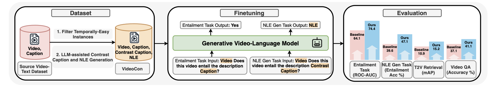

# Videocon: Robust Video-Language Alignment via Contrast Captions

[[Paper]](https://arxiv.org/abs/2311.10111) [[Project Page]](https://video-con.github.io/) [[Demo 🤗]](https://huggingface.co/spaces/hbXNov/owl-con-demo)[[Dataset 🤗]](https://huggingface.co/datasets/videocon/videocon) [[Model 🤗]](https://huggingface.co/videocon/owl-con/tree/main)


**Authors:** [Hritik Bansal (UCLA)](https://sites.google.com/view/hbansal), [Yonatan Bitton (Google)](https://yonatanbitton.github.io/), [Idan Szpektor (Google)](https://www.linkedin.com/in/idan-szpektor-916183?originalSubdomain=il), [Kai-Wei Chang (UCLA)](https://web.cs.ucla.edu/~kwchang/), [Aditya Grover (UCLA)](https://aditya-grover.github.io/)

<h1 align="center"></h1>


This repository contains the data and instructions to reproduce the results of the paper "Videocon: Robust Video-Language Alignment via Contrast Captions".

## Getting Started

The following steps are relevant for training and evaluating the model. 

1. Creating conda environment

```
conda create -n videocon python=3.10
conda activate videocon
```

2. Install Pytorch
```
    conda install pytorch==1.13.1 torchvision==0.14.1 torchaudio==0.13.1 pytorch-cuda=11.7 -c pytorch -c nvidia
```

3. Install other dependencies
```
    pip install -r requirements.txt
```

## VideoCon Data 

We present the fully processed dataset for training your models on the entailment and natural language explanation generation tasks.

### LLM (PaLM-2) Generated Data

🤗 [Entailment Data](https://huggingface.co/datasets/videocon/videocon/blob/main/videocon_llm_entailment.csv)
```
source: one of MSR-VTT, VaTeX, TEMPO-HL
videopath: path to the video in the source dataset
caption: video caption
neg_caption: PaLM-2 generated caption
split: one of train, val, and test
misalignment: one of the seven misalignments described in the paper
youtube_key: MSR-VTT and VaTeX videos have youtube ids (metadata)
```

🤗 [Feedback Data](https://huggingface.co/datasets/videocon/videocon/blob/main/videocon_llm_feedback.csv)
```
source: one of MSR-VTT, VaTeX, TEMPO-HL
videopath: path to the video in the source dataset
caption: video caption
neg_caption: PaLM-2 generated caption
nle: PaLM-2 generated natural language explanation
split: one of train, val, and test
misalignment: one of the seven misalignments described in the paper
youtube_key: MSR-VTT and VaTeX videos have youtube ids (metadata)
```

**Note: Original Dataset Licenses apply to individual source data.**

#### Downloading Videos

We provide detailed steps to download the source dataset videos in the individual README files in the [datasets](datasets/) folder.

### Human Generated Data

🤗 [VideoCon-Human](https://huggingface.co/datasets/videocon/videocon/blob/main/videocon_human.csv)

We collect the video-caption pairs from the validation set of the [ActivityNet](https://github.com/activitynet/ActivityNet/tree/master) dataset.
```
video_url: s3 link to the video
caption: caption associated with the video 
neg_caption: human-written negative caption
nle: human-written natural language explanation
hard: True or False (see the definition of Human-Hard in our paper)
```

## Finetuning

We finetune [mPLUG-Owl-7B-Video](https://huggingface.co/MAGAer13/mplug-owl-llama-7b-video) from this [repo](https://github.com/X-PLUG/mPLUG-Owl/tree/main/mPLUG-Owl) using Low-Rank Adaptation (LoRA).

Specifically, the model is finetuned on the entailment and natural language explanation generation task together. Firstly, we need to process the data files to format the data akin to the `mPLUG-Owl-7B-Video` training. 

### Data Processing

1. Change the `videopath` in the  `videocon_llm_entailment.csv` and `videocon_llm_human.csv` such that the paths point to the videos in your local machine.
2. Run the following command to create the entailment task prompt:
```python
python src/prepare_data_for_train.py --input_csv data/videocon_llm_entailment.csv --output_csv data/train_llm_entailment.csv --entailment 
```
It will generate three files -- train, val, test.
3. Run the following command to create the feedback task prompt:
```python
python src/prepare_data_for_train.py --input_csv data/videocon_llm_feedback.csv --output_csv data/train_llm_feedback.csv --feedback
```
It will generate three files -- train, val, test.
4. Now merge these files before we can start finetuning the model.
```python
python src/merge.py
```
This will create `data/train_llm_mix_entail_feedback.csv`, `data/val_llm_mix_entail_feedback.csv`, `data/test_llm_mix_entail_feedback.csv`.

### LLM Prompts for Contrast Caption Generation

1. We add the prompts for generating contrast captions from PaLM-2 in [misalignment_prompts.py](src/misalignment_prompts.py).
2. The prompts will work well with other LLM API too.
3. Example Code for PaLM-2 is present in this colab [notebook](https://colab.research.google.com/drive/1RR_ZgAOGP47fwCjleohHoaUeN8wWBsuU?usp=sharing). You will need to create a project on google console first.


### Setup

1. Download [mPLUG-Owl-7B-Video](https://huggingface.co/MAGAer13/mplug-owl-llama-7b-video) pretrained checkpoint in your local machine.
2. Add the data file paths and mplug-owl-7b path to [video.yaml](training/configs/video.yaml).
3. Add save path, experiment name, and nproc_per_node, path to mplug-owl-7b, and `CUDA_VISIBLE_DEVICES` in [train_it.sh](training/scripts/train_it.sh) script.
4. Run the following command to launch the training
```python
bash train_it.sh
```
5. You would find the finetuned checkpoints in your `SAVE_PATH`.

### Pretrained Checkpoint

Our finetuned VideoCon model is present 🤗 [here](https://huggingface.co/videocon/videocon-model/tree/main).

## Evaluation

Download the [mPLUG-Owl-7B-Video](https://huggingface.co/MAGAer13/mplug-owl-llama-7b-video) and [Owl-Con](https://huggingface.co/videocon/owl-con/tree/main) in your local machine. Their paths are necessary for evaluation. 

### Custom Inference

#### Entailment Inference
1. Create a csv with two columns: `videopath` and `text`. Example csv is [here](examples/test.csv)
2. Run the following command to embed the entailment prompt to the `text` field:
```python
    python src/prepare_data_for_inference.py --input_csv examples/test.csv --output_csv examples/final_test.csv
```
3. Run the following command to get the scores for the video and text in the `final_test.csv` using [entailment_inference](training/pipeline_video/entailment_inference.py) script.
```python
CUDA_VISIBLE_DEVICES=0 python entailment_inference.py --input_csv ../../examples/final_test.csv --output_csv ../../examples/final_test_scores.csv --trained_ckpt <path to pytorch.bin of videocon ckpt> --pretrained_ckpt <path to mplugowl-7b-video folder> --use_lora --all-params
```
This will save the entailment scores as an additional column in the `final_test_scores.csv`.

4. (Optional) Remove `--use_lora` and `--trained_ckpt` argument from the above to use the pretrained model to perform the entailment task.

### Entailment Evaluation (ROC-AUC)

1. It is straightforward to calculate ROC-AUC score using the `Custom Inference` code discussed above.
2. Firstly, you will need to convert your data into a csv with `videopath` and `caption` using 1. and 2. from the above section. 
3. Run the command to get the entailment score for every `videopath` and `caption`. 
4. You can write your logic to assign a `caption` a `label = 1` if it is grounded in the video, otherwise `label = 0`
5. Use the `roc_auc_score` in the sklearn [here](https://scikit-learn.org/stable/modules/generated/sklearn.metrics.roc_auc_score.html). Here, the predicted score will be the model's entailment score.


### NLE Inference
1. Create a csv with two columns: `videopath` and `neg_caption`. Example csv is [here](examples/test_nle.csv)
2. Run the following command to get the generated NLE using [nle_inference](training/pipeline_video/nle_inference.py) script.
```python
CUDA_VISIBLE_DEVICES=0 python nle_inference.py --input_file ../../examples/test_nle.csv --output_file ../../examples/final_test_nle.csv --pretrained_ckpt <path to mplugowl-7b-video folder> --trained_ckpt  <path to pytorch.bin of videocon ckpt> --use_lora --all_params
```
This will save the generated NLE in the `final_test_nle.csv`.

### NLE Evaluation

In our work, we propose two methods which achieve high agreement with human evaluation.

#### LLM Prompt
1. We use the prompt in [nle_eval_prompt](src/nle_eval_prompt.py) to get the LLM (PaLM2) decision.
2. Replace `c1` with positive caption, `c2` with negative caption, `c3` with ground-truth NLE, and `c4` with Owl-Con generated NLE.
3. Note: the prompt should work well with any other LLM API.

#### Q^2 
1. We use this [script](https://github.com/orhonovich/q-squared/blob/main/run_nli.py) to get the `ENTAILMENT SCORE`. 
2. We set the premise as the ground-truth feedback and hypothesis is the model generated NLE.

### Text to Video Retrieval (SSv2)

1. We download the videos from [here](https://developer.qualcomm.com/software/ai-datasets/something-something). If there are any issues with the download, feel free to [email](hbansal@g.ucla.edy) me.

#### SSv2-Temporal
1. We provide the SSv2-Temporal data in [eval_ssv2_temporal.csv](datasets/eval_ssv2_temporal.csv). Here, each caption has `216` candidate videos. The number of comparisons will be `216 * 18 (query actions)`.
2. You can use the above file directly to get the entailment scores from our finetuned model using
```python
CUDA_VISIBLE_DEVICES=0 python entailment_inference.py --input_csv datasets/eval_ssv2_temporal.csv --output_csv eval_ssv2_temporal_scores.csv --trained_ckpt <path to pytorch.bin of videocon ckpt> --pretrained_ckpt <path to mplugowl-7b-video folder> --use_lora --all-params
```
(Optional) Remove `--use_lora` and `--trained_ckpt` argument from the above to use the pretrained model to perform the entailment task.

It will generate an output file just like [eval_ssv2_temporal_scores.csv](datasets/eval_ssv2_temporal_scores.csv). Ignore the values in the last two columns. The number in the third column is the entailment score.
3. Use the [calc_ssv2.py](src/calc_ssv2.py) to get the mAP and Recall scores using the following command:
```python
python src/calc_ssv2.py --input_file_1 datasets/eval_ssv2_temporal.csv --input_file_2 datasets/eval_ssv2_temporal_scores.csv --vid_per_caption 216
```

#### SSv2-Events
1. We provide the SSv2-Events data in [eval_ssv2_events.csv](datasets/eval_ssv2_events.csv). Here, each caption has `588` candidate videos. The number of comparisons will be `588 * 49 (query actions)`.
2. You can use the above file directly to get the entailment scores from our finetuned model using
```python
CUDA_VISIBLE_DEVICES=0 python entailment_inference.py --input_csv datasets/eval_ssv2_events.csv --output_csv eval_ssv2_events_scores.csv --trained_ckpt <path to pytorch.bin of videocon ckpt> --pretrained_ckpt <path to mplugowl-7b-video folder> --use_lora --all-params
```
(Optional) Remove `--use_lora` and `--trained_ckpt` argument from the above to use the pretrained model to perform the entailment task.
It will generate an output file just like [eval_ssv2_temporal_scores.csv](datasets/eval_ssv2_events_scores.csv). Ignore the values in the last two columns. The number in the third column is the entailment score.
3. Use the [calc_ssv2.py](src/calc_ssv2.py) to get the mAP and Recall scores using the following command:
```python
python src/calc_ssv2.py --input_file_1 datasets/eval_ssv2_events.csv --input_file_2 datasets/eval_ssv2_events_scores.csv --vid_per_caption 588
```

### Video Question Answering (ATP-Hard)

1. The videos for the dataset are available [here](https://drive.google.com/file/d/1jTcRCrVHS66ckOUfWRb-rXdzJ52XAWQH/view) i.e., [NextQA](https://paperswithcode.com/dataset/next-qa) dataset.
2. The original NextQA validation set question and answers are present [here](https://github.com/doc-doc/NExT-QA/blob/main/dataset/nextqa/val.csv). The ATP-HARD subset consists of the following indices: [here](https://stanfordvl.github.io/atp-revisit-video-lang//assets/atp-hard-ct4.txt). We present the ATP-Hard [here](datasets/nextqa-atphard.csv).
3. We use LLM API to convert the Question-Answer pairs into imperative statements. The prompt for the same is present in [atp_hard_prompt.py](src/atp_hard_prompt.py) 
4. The LLM-generated statements are added to [atp_hard_statements.csv](datasets/nextqa-atphard-statements.csv).
5. Use the [eval_nextqa](src/create_data_for_eval_nextqa.py) script to prepare the data for entailment score generation. 
```python
python src/create_data_for_eval_nextqa.py --input_csv datasets/nextqa-atphard-statements.csv --output_csv eval-nextqa-atphard.csv --map_json map_vid_vidorID.json (from the nextqa dataset itself) --video_dir <location of the videos>
```
It will generate a csv like [eval-nextqa-atphard.csv](datasets/eval-nextqa-atphard.csv)
6. Use the `Entailment Inference` code to generate the entailment scores. It can be used to generate a file like [atphard_scores](datasets/atphard_scores.csv). Ignore the last two columns in this file.
7. Use the following code to get the final accuracies:
```python
python src/eval_atphard.py --input_csv_1 datasets/eval-nextqa-atphard.csv [ground-truth] --input_csv_2 datasets/atphard_scores.csv [prediction] --input_csv_3 datasets/nextqa-atphard.csv
```
